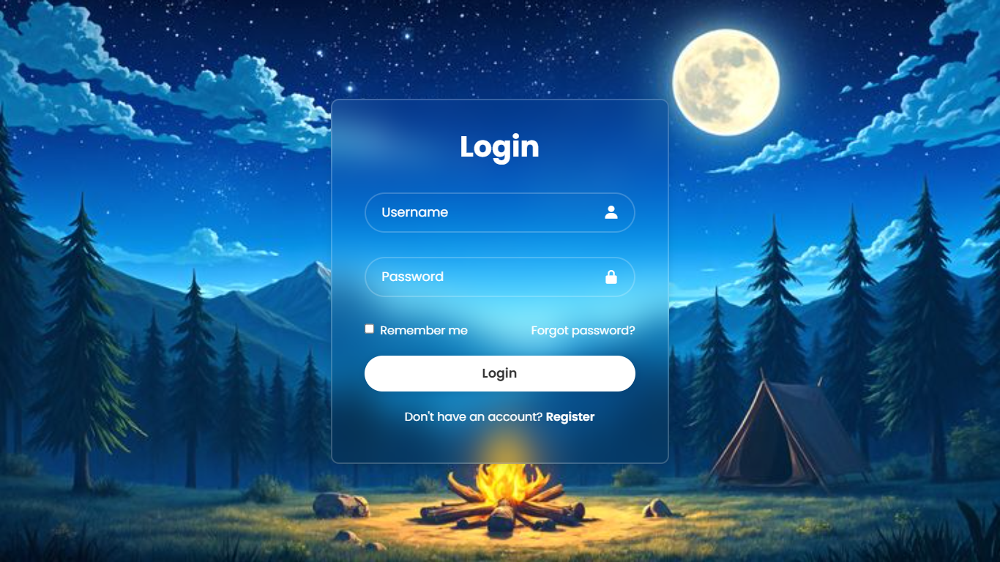

# 🌌 Log-in Web Page

A sleek and modern **Login Page UI** built using **HTML, CSS, and JavaScript**, featuring a calming night sky camping theme.  
Designed for responsive performance and a smooth user experience across all devices.

---

## 🖼️ Preview

---

## 🌐 Live Demo
[🔗 View the Login Page](https://gugilla-aakash.github.io/Log-in_web-page/)

---

## ✨ Features

- 🧑‍💻 **User-friendly login form** with username and password fields  
- 🔒 Password input with hidden characters  
- 🌙 **Beautiful night forest theme** background  
- 🧊 Glassmorphism-style login box with blur and gradient  
- 📱 **Responsive design** (works on all screen sizes)  
- 💾 “Remember me” checkbox and “Forgot password?” link  
- 🆕 Link to registration for new users  

---

## 🧩 Technologies Used

- **HTML5** – structure and semantic layout  
- **CSS3** – gradient backgrounds, glassmorphism, responsiveness    

---
